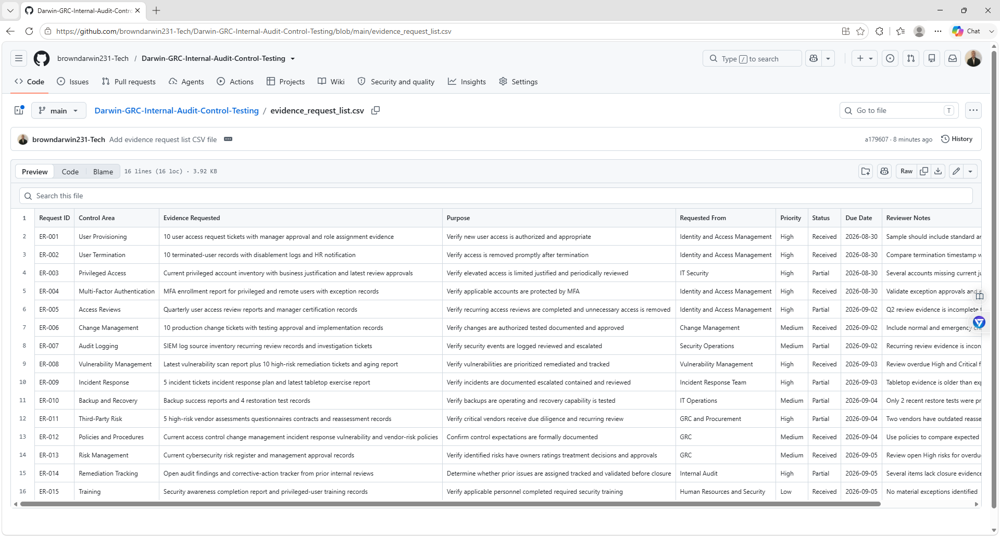
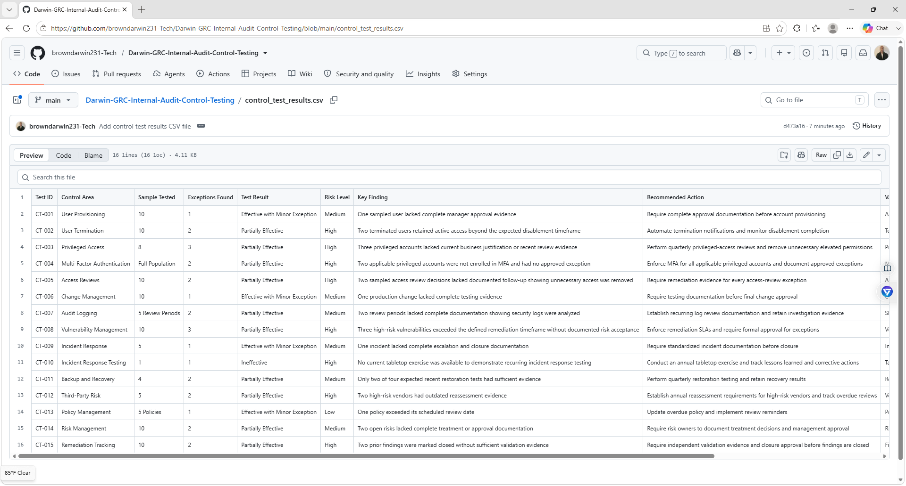
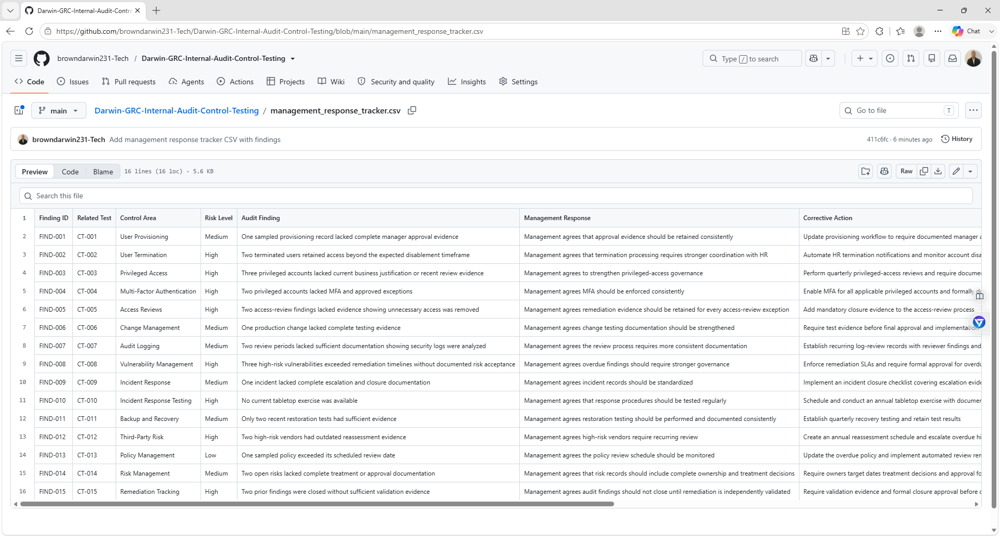
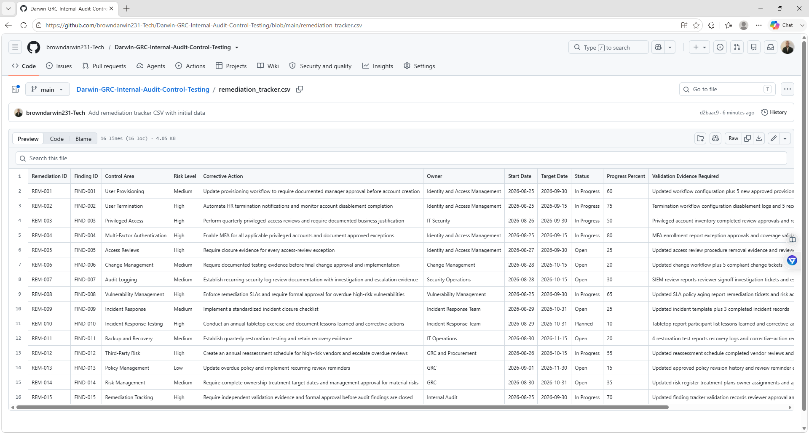

# Darwin-GRC-Internal-Audit-Control-Testing

## Project Overview

This project simulates an internal audit and control testing engagement for a fictional organization called **Northbridge Technologies**.

The goal is to demonstrate practical Governance, Risk, and Compliance skills related to:

- Internal audit
- Control testing
- Audit evidence review
- Walkthroughs
- Test procedures
- Exception identification
- Risk evaluation
- Management responses
- Remediation tracking
- Audit reporting

This project is designed to show how a GRC analyst can plan an audit, evaluate controls, document findings, and track remediation through closure.

## Business Scenario

Northbridge Technologies is a fictional technology company preparing for an internal security and compliance review.

The organization uses:

- Microsoft 365
- Microsoft Entra ID
- Cloud infrastructure
- Endpoint security tools
- Centralized logging
- Vulnerability scanning
- Ticketing systems
- Third-party vendors
- Backup and recovery systems

Management requested an internal audit to evaluate whether key security controls are properly designed, implemented, and operating effectively.

## Audit Objectives

The audit focuses on:

- Logical access
- Privileged access
- User provisioning and termination
- Multi-factor authentication
- Change management
- Audit logging
- Vulnerability management
- Incident response
- Backup and recovery
- Third-party risk

## Audit Methodology

The simulated audit follows these steps:

1. Define audit scope
2. Identify key controls
3. Request supporting evidence
4. Conduct control walkthroughs
5. Define test procedures
6. Review audit evidence
7. Perform control testing
8. Document exceptions
9. Assign risk ratings
10. Obtain management responses
11. Create remediation actions
12. Track findings through closure
13. Produce an audit summary

## Control Testing Ratings

Each control is assigned one of the following results:

- Effective
- Effective with Minor Exception
- Partially Effective
- Ineffective
- Not Tested

## Evidence Review

Example evidence reviewed in this project includes:

- User access reports
- Privileged account inventories
- MFA configuration
- Access review approvals
- Change tickets
- Audit logs
- Vulnerability scan reports
- Incident tickets
- Backup reports
- Vendor security assessments
- Policies and procedures

## Risk Rating Method

Risk is evaluated using:

**Risk Score = Likelihood × Impact**

### Risk Ratings

- 1–4 = Low
- 5–10 = Medium
- 11–15 = High
- 16–25 = Critical

## Example Audit Finding

### Privileged Access Review

**Control Objective:**  
Privileged access should be limited to authorized users and periodically reviewed.

**Current State:**  
Privileged roles are assigned through Microsoft Entra ID, but quarterly review evidence is incomplete.

**Test Result:**  
Partially Effective

**Risk Level:**  
High

**Exception:**  
Several privileged accounts lacked recent documented business justification.

**Recommendation:**  
Perform quarterly privileged-access reviews, document business justification, remove unnecessary permissions, and retain reviewer approval evidence.

## Management Response Process

Each audit finding includes:

- Finding ID
- Risk rating
- Management response
- Corrective action
- Responsible owner
- Target completion date
- Status
- Validation evidence
- Closure decision

## Repository Structure

Darwin-GRC-Internal-Audit-Control-Testing/
│
├── README.md
├── audit_scope.md
├── evidence_request_list.csv
├── control_test_plan.csv
├── control_test_results.csv
├── audit_exceptions.md
├── management_response_tracker.csv
├── remediation_tracker.csv
├── audit_summary.md
└── evidence/

## Evidence Screenshots

### Evidence Request List

### Control Test Results

### Management Response Tracker

### Remediation Tracker

## Skills Demonstrated

- Internal Audit
- GRC
- Control Testing
- Audit Planning
- Audit Evidence Review
- Control Walkthroughs
- Test Procedures
- Exception Documentation
- Risk Assessment
- Management Responses
- Remediation Tracking
- Audit Reporting
- Access Review
- Change Management
- Vulnerability Management
- Incident Response
- Third-Party Risk

## Project Goal

The goal of this project is to demonstrate practical internal audit and GRC skills by planning a simulated audit, testing controls, reviewing evidence, documenting exceptions, evaluating risk, obtaining management responses, and tracking remediation.

This is a simulated portfolio project and does not represent internal audit work performed for a real organization.
